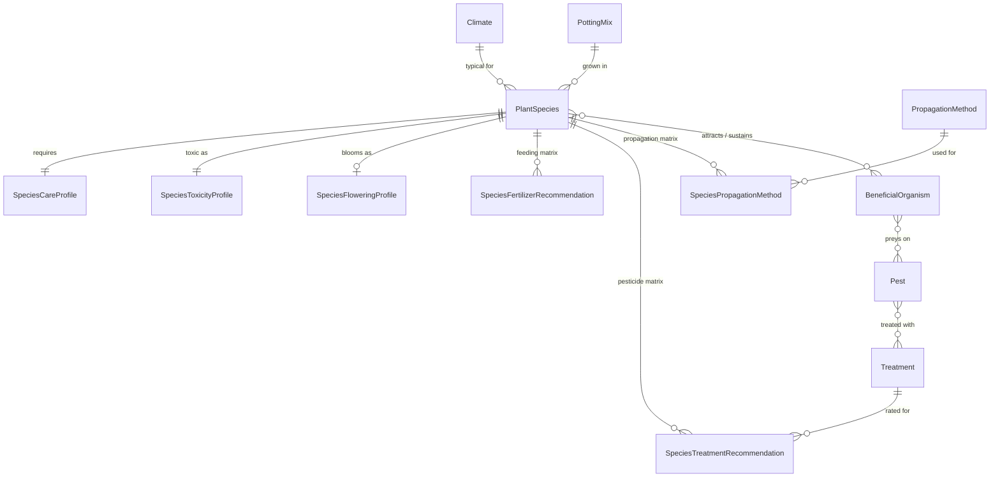
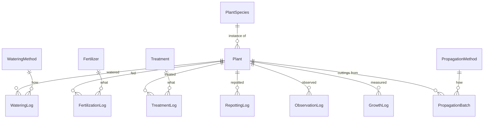

# Architecture

Design reference for PlantKeeper. This document describes how the system is put
together and why — the decisions behind the code, not a catalogue of it. For
day-to-day working conventions see [CLAUDE.md](CLAUDE.md).

**Status:** backend only. The frontend section is a placeholder; see
[Frontend](#3-frontend).

---

## 1. System overview

PlantKeeper tracks a real, specific plant collection — 48 species on a balcony and
rooftop in Mexico City — and the care history that goes with it: waterings,
fertilizations, treatments, repottings, observations, growth measurements, and
propagation attempts.

The domain reference is [`docs/almanaque-de-plantas.md`](docs/almanaque-de-plantas.md),
a hand-maintained Spanish-language almanac. The database schema is derived from its
tables, and that document remains the source of truth for the *content* of the
reference data. Schema changes should be checked against it.

The repository is a monorepo holding two independently developed projects:

| Project | Stack | Role |
|---|---|---|
| `PlantKeeperAPI/` | ASP.NET Core 10, EF Core, MySQL | REST API and the whole domain model |
| `PlantKeeperWebApp/` | Angular 18 | Client (scaffold only — see [Frontend](#3-frontend)) |

### Branch model

Work happens on long-lived per-tier branches — `backend` and `frontend` — which merge
into `development` and then `main`. The consequence to plan around: **the two projects
routinely sit at different points in the schema's evolution.** The frontend does not
track backend changes automatically, and today it is several breaking changes behind.
Never assume a frontend interface reflects the current API contract.

---

## 2. Backend

### 2.1 Stack

| Component | Version | Notes |
|---|---|---|
| Target framework | .NET 10 | |
| EF Core | 9.0.0 | via `Pomelo.EntityFrameworkCore.MySql` |
| Database | MySQL 8.0.38 | server version pinned in `Startup.cs` |
| Object mapping | Mapster 7.4.0 | replaced AutoMapper in commit `339e341` |
| API docs | Swashbuckle 10.1.0 | Swagger UI, Development only |

Two version notes worth tracking: the EF Core runtime packages are on the 9.x line
while the SDK and `Microsoft.AspNetCore.OpenApi` are on 10.x, and the local `dotnet ef`
CLI is 10.0.3 driving a 9.0.0 provider. This works today but is not a combination to
rely on indefinitely. Restore also reports `NU1903` — a known high-severity advisory
against `Microsoft.OpenApi` 2.3.0, pulled in transitively by Swashbuckle.

### 2.2 Project layout

```
PlantKeeperAPI/
  PlantKeeperAPI.sln
  src/
    Program.cs               # composition root and HTTP pipeline
    Initialization/          # service-registration extension methods
    Entities/                # EF Core domain model (23 types)
    Enums/                   # closed value sets from the almanac (12 types)
    Database/
      PlantKeeperDbContext.cs
      Migrations/
    DataTransferObjects/     # read-side API shapes
    Models/                  # write-side API shapes (Input*)
    Controllers/
  tests/                     # empty — no test project exists yet
```

### 2.3 Request pipeline

`Program.cs` is the composition root. The pipeline is deliberately minimal:

```
Controllers (ReturnHttpNotAcceptable = true)
  -> AddDatabase(...)   # environment-selected connection string
  -> AddMapster()
  -> Swagger + CORS "devenv"   [Development only]
  -> UseHsts + UseCors()       [non-Development]
  -> UseAuthorization
  -> MapControllers
```

`ReturnHttpNotAcceptable = true` means the API returns **406** rather than silently
falling back to JSON when a client asks for an unsupported media type. Combined with
`[Produces(MediaTypeNames.Application.Json)]` on every controller, the contract is
strictly JSON — clients must send a compatible `Accept` header.

Three deliberate gaps exist here, each currently harmless but each a trap:

- **`UseAuthorization()` runs without `UseAuthentication()`.** The authentication call
  is commented out. Every endpoint is anonymous. Adding `[Authorize]` to a controller
  today would fail closed in a confusing way rather than prompting for credentials.
- **`UseCors()` in non-Development names no policy**, and no default policy is
  registered. Outside Development, CORS is effectively disabled — a deployed frontend
  on another origin will be blocked until a real policy is added.
- **The permissive `devenv` policy** (any origin, header, method) is Development-only,
  which is correct, but means cross-origin behaviour is never exercised before deploy.

### 2.4 Configuration and environments

Connection strings are resolved in
[`Startup.AddDatabase`](PlantKeeperAPI/src/Initialization/Startup.cs) by switching on
`IWebHostEnvironment.EnvironmentName`:

| Environment | Configuration key |
|---|---|
| `Production` | `ConnectionStrings:Production` |
| `CAE` | `ConnectionStrings:CAE` |
| `QAE` | `ConnectionStrings:QAE` |
| anything else | `ConnectionStrings:Dev` |

No connection string is committed. `Dev` is supplied through .NET user-secrets — the
project carries a `UserSecretsId` — so `appsettings*.json` stays free of credentials
and should remain that way.

Local ports come from `Properties/launchSettings.json`: HTTP on **5033**, HTTPS on
**7022**, both launching straight to Swagger with the browser suppressed.

### 2.5 Layering

The backend is a thin, deliberately un-abstracted CRUD API:

```
HTTP request
  -> Controller          # ASP.NET routing, validation, status codes
  -> IMapper (Mapster)   # Input model -> Entity
  -> PlantKeeperDbContext
  -> MySQL
```

There is **no repository or service layer**. Controllers inject `PlantKeeperDbContext`
and `IMapper` directly. This is a reasonable fit for a single-writer personal
application, and it should stay this way until something genuinely needs shared
business logic — introducing a service layer for its own sake would add indirection
without removing any.

Three distinct shapes exist per resource, and the split is intentional:

| Layer | Location | Purpose |
|---|---|---|
| **Entity** | `Entities/` | Persistence shape. No validation attributes. |
| **DTO** | `DataTransferObjects/` | Read shape returned to clients. |
| **Input model** | `Models/`, named `Input<Entity>` | Write shape accepted in request bodies. Carries `DataAnnotations` validation. |

Keeping entities free of validation attributes means the persistence model never
leaks into the API contract, and API-level validation can be stricter or looser than
the database without fighting it. The cost is a real one: **validation rules live in
two places** — `DataAnnotations` on input models and Fluent API in the `DbContext` —
with nothing keeping them in sync. They have already drifted (see
[Known issues](#210-known-issues-and-drift)).

### 2.6 Persistence

#### The DbContext is the single source of truth for schema

All keys, relationships, string lengths, precision, and enum conversions are declared
in [`PlantKeeperDbContext.OnModelCreating`](PlantKeeperAPI/src/Database/PlantKeeperDbContext.cs),
never as attributes on entities. One file describes the entire schema. Adding a field
means touching the entity, that file, and then a migration — all three, every time.

The configuration follows a consistent block shape per entity: `// Primary key`, then
`// Foreign keys`, then scalar constraints. String lengths cluster at 30–50 for names,
150 for short prose, 255 for descriptions and notes, and 300 for the longest free text.
Those ceilings were checked against the longest real value in the almanac; the tightest
is `SeedViability` at 135 of 255.

#### Enums are stored as strings

Every enum property is mapped with `.HasConversion<string>()`. The reason is
operational: this database is browsed by hand against a Markdown document, and a row
reading `Suitability = 'RecommendedDiluted'` is checkable at a glance where `2` is not.
It also removes the class of bug where reordering enum members silently reinterprets
existing rows. The cost is wider columns, which does not matter at this scale.

`BeneficialRole` is a `[Flags]` enum and round-trips as `"Pollinator, Predator"`.

#### Migrations

Migrations live in `src/Database/Migrations/`. Two exist:

| Migration | Contents | Applied |
|---|---|---|
| `20260104161200_InitialMigration` | Original core schema | **yes**, on Dev |
| `20260829174653_AddSpeciesCareAndEcosystem` | Species profiles, recommendation matrices, pests and beneficials, propagation, growth logs — 14 tables, 3 columns | no |

The second migration also carries the un-migrated rename from commit `32567cf`
(`FertilizationMethod` → `Fertilizer`, `TreatmentMethod` → `Treatment`), which EF
scaffolded as drop-and-create rather than `RenameTable`. **Because `InitialMigration`
is already applied to the Dev database, those two lookup tables exist there and running
`database update` will drop them along with any rows.** Check them before migrating.

> **Watch the scaffolder on renames.** Generating this migration, EF paired the dropped
> `PlantSpecies.NameInSpanish` with the newly added `FertilizationFrequency` and emitted
> a `RenameColumn` between them — which would have moved Spanish plant names into the
> fertilization column. It was hand-corrected to a drop plus an add. EF infers renames
> heuristically whenever one column disappears and another appears in the same table;
> read every `RenameColumn` it produces.

The schema totals **26 tables**: 23 entity tables plus three implicit many-to-many
join tables.

> **Trap:** `PlantKeeperDbContext` has a parameterless constructor and an
> `OnConfiguring` override calling `UseMySql("", ServerVersion.AutoDetect(""))`. That
> would throw on an empty connection string if ever reached. It exists only to satisfy
> design-time tooling, and the tooling does not in fact need it — `dotnet ef` resolves
> the context through the application's DI container. It is effectively dead code
> guarding against a case that cannot occur, and removing it would be safe.

### 2.7 Domain model

The model divides cleanly in two, and the division is the most important thing to
understand about it.

**Reference data** describes a *species* — what it needs, what it attracts, what will
poison the cat. It is transcribed from the almanac and changes rarely.

**Records** describe an individual *plant* — what was actually done to it, and when.
It grows continuously.

`Plant` is the hinge: an individual specimen with an `Alias` ("the one on the left"),
pointing at the `PlantSpecies` that supplies everything generic about it.

#### Reference data



#### Records



#### Modelling decisions worth knowing

**One `BeneficialOrganism`, not separate pollinators and predators.** The almanac has
two tables that overlap on roughly six creatures. Hoverflies pollinate as adults and
eat aphids as larvae; hummingbirds pollinate but are not insects. Splitting them would
duplicate rows and force manual sync. A single entity with a `[Flags]` role covers
both, and "pollinators this species attracts" turns out to be the same relationship as
"plants that sustain this organism" read from the other end — one many-to-many serves
both tables.

**The fertilizer matrix keys on a category enum, not on `Fertilizer`.** The almanac's
matrix has four columns (nitrogen-only, balanced, bloom, organic) but names eight
concrete products, and a fertilization log records what was actually applied
("Triple 17"). Those are two different granularities. `FertilizerCategory` drives the
matrix; `Fertilizer.Category` maps each product into a column.

**Matrix rows carry their own qualifiers.** `SpeciesPropagationMethod` holds rooting
hormone, season, and difficulty on the *join*, not on the species, because the
almanac's advice is per-method: Retama's "hormone recommended" applies to the cutting,
while its primary method is seed. On a species-level column that guidance would attach
to the wrong method.

**Structured fields get a paired `*Notes` column.** `SoilPhMin`/`SoilPhMax` cannot
express "6.0–7.0 (watch out for alkaline Mexico City tap water)", and that caveat is
load-bearing — it is the same theory the fertilization log floats for the apple tree's
suspected phosphorus deficiency. Hence `SoilPhNotes`, and likewise
`HumanToxicity`/`HumanToxicityNotes`. The source document qualifies its values
routinely; the schema has to allow for it.

**Required by default, because the blanks are gaps not absences.** Reading the source
shows every empty care cell is "nobody looked it up yet" — six rosette succulents have
no care data at all, four tropicals are missing exactly light and wind. Nullable
columns let that hide, so the care and toxicity columns are `NOT NULL`. Toxicity
especially: an unresearched species must never read as harmless in a house with pets.
Only two things stay nullable — `*Notes` columns, and whole concerns that genuinely do
not apply.

**Flowering genuinely does not apply.** Only 35 of 48 species flower; Boston Fern is a
spore plant. `SpeciesFloweringProfile` is therefore an optional 1:1 table — absence is
a missing row, not a row of nulls — which is what lets *its* columns be `NOT NULL` in
turn. `FloweringHabit` on the species states the fact explicitly, keeping "never
flowers" distinct from "not researched", and carries the ivy/jade case of blooming in
nature but never in a pot.

**Three concerns split into 1:1 profile tables.** `PlantSpecies` had grown to ~25
scalars. Care, toxicity and flowering moved to their own tables, each keyed on
`SpeciesId` as both primary and foreign key — no surrogate column, one profile per
species enforced by the schema. Owned types were considered and rejected: they keep one
table but prefix every column (`Care_LightMin`). The trade-off is that with the FK on
the dependent, the database cannot enforce that a species *has* a care row; that
guarantee is C#-only. What the database still guarantees is that a profile which exists
is complete.

**Closed scales became enums; prose stayed prose.** `WindTolerance` was 23 free-text
strings hiding a three-level scale — and had already drifted, with `Media` and
`Moderada` meaning the same thing. `LightLevel` is an ordered scale used as a
`LightMin`..`LightMax` range, since the almanac writes light as a span. All 38 light
and 23 wind source values decompose onto them. `WateringRequirement` stayed a string:
37 distinct values in 42 rows is real prose. Transcription is interpretive enough to
want a human eye — `"Indirecta, sombra"` uses its comma as a range separator while
most rows use it for a qualifier.

#### Data state

**All almanac tables are empty.** The schema exists; no seed data has been loaded. The
48 species, the lookup rows, and the matrices still live only in the Markdown file.

Loading is now gated on research, by design: 13 of 48 species lack care data the schema
requires — six rosette succulents entirely, four tropicals missing light and wind, and
three one-off gaps (Bougainvillea/climate, Gladiola/max temp, Cilantro/min temp). A
further 10 rows need `BloomCareNotes` and 7 need `SeedHarvestTiming`.
Choosing a loading strategy — EF `HasData` in a migration, a seeding service, or an
import endpoint — is an open decision.

### 2.8 API conventions

- Routes are `/api/<resource-plural-kebab-case>`, declared explicitly per controller.
- Identifiers are `Guid` everywhere, constrained in routes as `{id:guid}`.
- Standard CRUD verbs: `GET /`, `POST /`, `GET /{id}`, `PUT /{id}`, `DELETE /{id}`.
- List endpoints sort server-side (commit `ae9e5ac`); clients receive ordered data.
- Every action declares `[ProducesResponseType]` for each status it can return, so the
  generated OpenAPI document is accurate.
- `PUT` and `DELETE` return `204 No Content`; `POST` returns `201` with
  `CreatedAtAction`.

**Foreign keys are validated in the controller.**
[`WateringLogsController`](PlantKeeperAPI/src/Controllers/WateringLogsController.cs)
loads each referenced entity, accumulates `ModelState` errors, and returns
`422 Unprocessable Entity` with a `ValidationProblemDetails` body rather than letting
the insert fail as a database-level FK violation. This is the intended pattern for any
resource with foreign keys — it produces a field-addressable error the client can act
on. Only `WateringLogsController` implements it so far.

Coverage is thin: **3 of 23 entities have controllers** (`Plants`, `WateringLogs`,
`WateringMethods`). None of the almanac entities are exposed.

### 2.9 Object mapping

Mapster is registered via `AddMapster()` and injected as `IMapper`. There are **no
`TypeAdapterConfig` classes** — every mapping relies on convention, matching source and
destination property names.

This is the most fragile thing in the codebase, and the fragility is silent. When names
do not line up, Mapster does not throw; it leaves the destination property at its
default. A renamed entity property produces empty strings and `Guid.Empty` at runtime
with a clean compile and no warning. Every mismatch listed below is of exactly this
kind.

Adding explicit `TypeAdapterConfig` registrations — or calling
`TypeAdapterConfig.GlobalSettings.Compile()` at startup to surface unmapped members
eagerly — would convert this class of bug from silent to loud.

### 2.10 Known issues and drift

Verified against the current tree. None of these break the build.

| # | Issue | Effect |
|---|---|---|
| 1 | `PlantDto` and `InputPlant` expose `Name`/`Care`; the entity has `Alias`/`Comments`/`SpeciesId` | Plant create/read silently maps nothing |
| 2 | `InputWateringLog.WateringMethodId` vs entity `WateringLog.MethodId` | FK never populated by convention mapping |
| 3 | `KeeperId` survives on `InputWateringLog` and `WateringLogDto` | Orphan from the `Keeper` entity removed in `7c6bb9b` |
| 4 | `InputWateringMethod.Name` is `[StringLength(20)]`; the column is `HasMaxLength(30)` | Validation stricter than storage, drifted silently |
| 5 | `DbContext.OnConfiguring` calls `AutoDetect("")` | Would throw if reached; unnecessary |
| 6 | `UseCors()` outside Development names no policy | Cross-origin blocked once deployed |
| 7 | `UseAuthorization()` without authentication | No auth anywhere |
| 8 | 20 of 23 entities have no controller | Almanac data unreachable over HTTP |
| 9 | No test project | `tests/` is an empty directory |

Items 1–3 share a root cause: the entities were reshaped across commits `7c6bb9b`,
`0b71531`, and `32567cf` without the API layer following. Reconciling the DTO and input
models against the current entities is the single highest-value cleanup available, and
it should land before any new controllers are written on top of the same pattern.

---

## 3. Frontend

**Placeholder.** This section will be filled in when a frontend is built.

`PlantKeeperWebApp/` currently holds an Angular 18 scaffold that predates the current
schema and does not reflect it. It is a standalone-component app — routes bound
directly to components in `app.routes.ts`, no NgModules — with feature folders per
resource, each holding a plain interface, a list component, and a details component.
All HTTP goes through a single root-provided `PlantKeeperService` that builds URLs from
`environment.apiHost` (`http://localhost:5033` in development).

Its contract is stale in the same three ways the API's own DTOs are: `Plant` is
`{ id, name, care }`, a `Keeper` interface and `/keepers` routes still exist for an
entity deleted from the backend, and `WateringLog` still carries `keeperId`. Treat it
as a reference for the intended shape of a client, not as a working one.

When the real frontend arrives, this section should cover component and state
architecture, the API client layer, routing, and how the shared contract is kept in
sync with the backend — the failure mode this repository has demonstrated twice.

---

## 4. Cross-cutting concerns

### The contract between tiers

Nothing enforces agreement between the API and its clients. The API's OpenAPI document
is generated and accurate, but no client is generated from it — the Angular interfaces
are hand-written, which is precisely how they drifted. Generating the client from the
OpenAPI schema would make this class of drift impossible, and is worth doing before
the frontend is rebuilt rather than after.

### Language

Code is English — entity names, properties, routes, enum members. The *data* is
Spanish, because the collection and its almanac are. A `PlantSpecies` row has an
English property `NameInSpanish` holding `"Sábila"`. This split is deliberate; keep it.

### Testing

There is none. `PlantKeeperAPI/tests/` exists and is empty. The DbContext
configuration — 23 tables of lengths, precision, cascade behaviour, and unique indexes
— is the part most worth covering first, and EF Core's in-memory or SQLite provider
would make that cheap.

---

## 5. Open decisions

1. **Seeding.** How does the almanac's content get into the database — `HasData` in a
   migration, a seeding service, or an import endpoint? Also: does the Markdown file
   remain the source of truth after loading, or does the database take over?
2. **Completing the almanac.** 13 species cannot be loaded until their care data is
   researched. That work gates seeding entirely.
3. **API surface for reference data.** Full CRUD for all 20 uncovered entities is a lot
   of near-identical code. A generic controller base, or read-only endpoints for
   lookups, may serve better.
4. **Authentication.** Single-user today. If the app is ever deployed publicly, the
   commented-out authentication and the missing CORS policy both need real answers.
5. **Package alignment.** Bringing EF Core onto the 10.x line alongside the SDK, and
   resolving the `NU1903` advisory.
